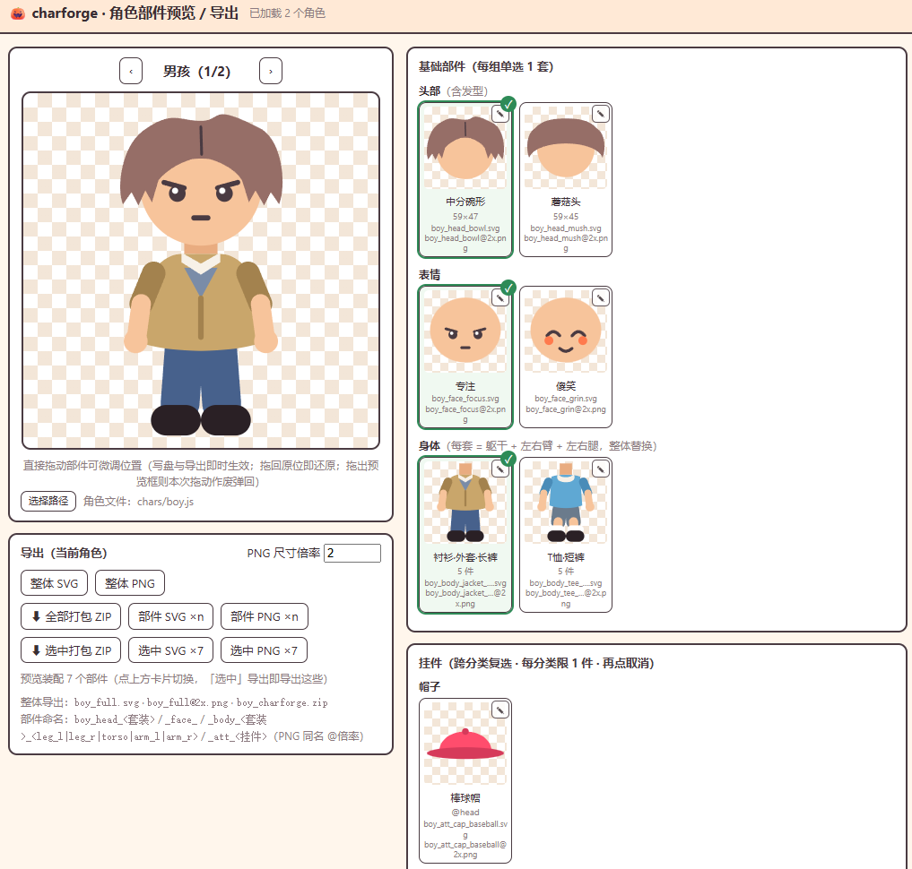

<b>English | <a href="README.md">中文</a></b>

# CharForge · Part-based 2D Game Character Generation & Export

**A character-generation SKILL that works with an Agent**: the Agent generates 128px chibi game characters from your description — pure SVG vector art, no skeleton, no animation, modular and outfit-swappable. After generation you can open `charforge.html` to manually fine-tune, preview, and export, ready for game engines like Cocos.

## How to Install

Give your Agent the `skill` directory and let it install it for you.

## Workflow

> What's generated directly usually isn't usable as-is — three steps make it a finished asset.

1. **Generate with the Skill**: give the Agent a one-line description (style + character + what you want). The Agent generates the character assets per the skill's rules — head / face / body groups, plus accessories like hats, glasses, and weapons. Each character is a self-contained `.js` file; drop it into `app/chars/` and you're done (auto-discovered, no HTML to edit).
2. **Fine-tune manually**: open `app/charforge.html` and take over — preview the assembled result; drag items on the stage to reposition; click a part's ✎ to open the SVG editor and hand-edit shapes / anchors / colors (undo/redo supported).
3. **Export assets**: single parts, the currently selected assembly, or the whole character — one-click packaging as SVG / PNG / ZIP, ready for your game engine.

> One HTML is a runnable tool: double-click to use, no server needed, and the whole `app/` directory can be copied away for delivery.

## How a Character Is Split

Every character is split into fixed four part groups — **changing outfit = swapping options within these groups** — freely combinable, no clipping:

1. **Head (headsets)**: head shape + hairstyle replaced as a whole head; pick one.
2. **Face (faces)**: drawn on top of the head; pick one.
3. **Body (bodies)**: one set = left leg / right leg / torso / left arm / right arm (5 parts), **replaced as a whole** (changing outfit = swapping the whole set).
4. **Accessories (attachments)**: hats, glasses, weapons, back items, shoe items, etc., each hanging on a fixed anchor point (head/body/back/left hand/right hand/left foot/right foot); selected by **cat category** — only one per category, but multiple categories can be worn at once, unlimited quantity.

## Key Features

- **Archive-as-file**: all character assets live inside the character's own `.js` — easy to manage and distribute.
- **Consistency guardrail**: body-part size differences stay within 20% for same-style characters, so outfits/skins never clip and parts stay interchangeable.
- **Engine-ready**: exported PNGs auto-adjust margins to each part's actual outline, so even thick strokes aren't clipped.
